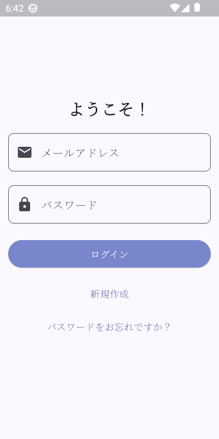
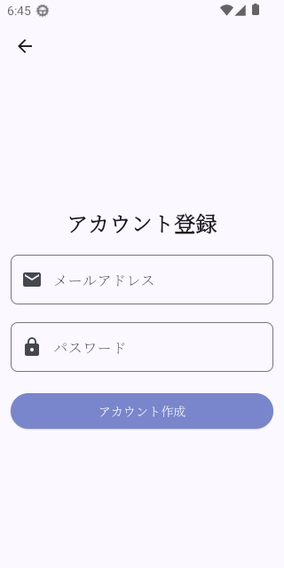
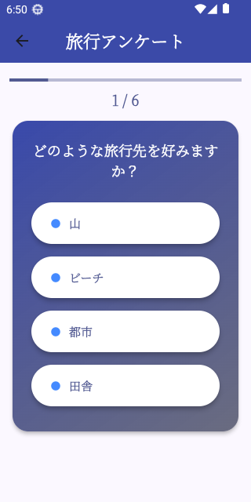
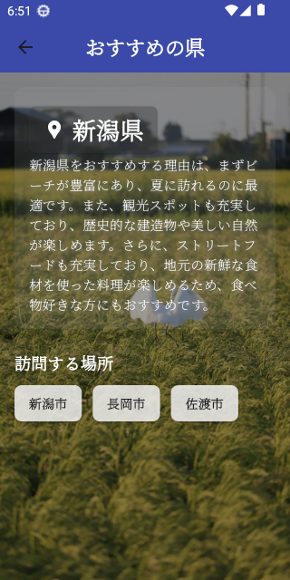
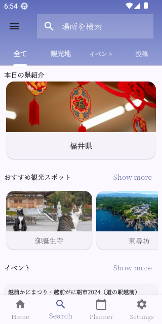
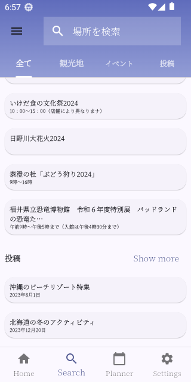
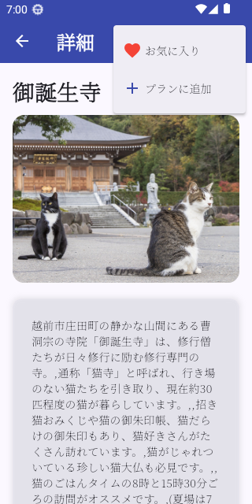
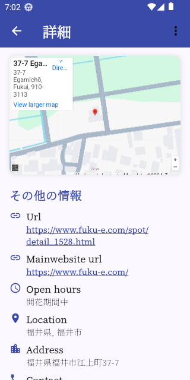
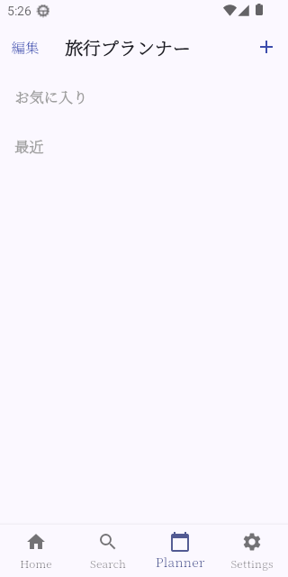
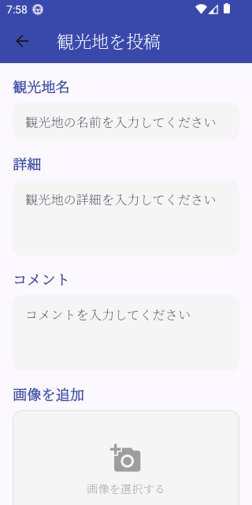

# 🌍 Flutter Travel App

A comprehensive travel application built with Flutter as part of the 創造ものづくり (Creative Manufacturing) class project. This app helps users plan, discover, and manage their travel experiences with an intuitive and feature-rich interface.

## 📱 Features

- **User Authentication** - Secure login system
- **Home Dashboard** - Central hub for travel information
- **Travel Planner** - Plan and organize your trips
- **Recommendations** - Discover new destinations and activities
- **Search Functionality** - Find specific locations, hotels, and attractions
- **Settings Management** - Customize your app experience
- **Offline Database** - Local data storage for seamless experience

## 📱 App Prototype & Screenshots

### Main Screens Overview
<p align="center">
  
  
  
  
</p>

### Core Features
<p align="center">
  
  
  
  
</p>

### Additional Screens
<p align="center">
  
  
  
</p>

## 🏗️ Project Structure

```
lib/
├── main.dart                 # App entry point
├── back_end/                 # Backend services and configurations
│   ├── configs.dart          # App configuration settings
│   ├── page_controller.dart  # Navigation and page state management
│   └── service.dart          # API services and business logic
├── db/                       # Database layer
│   ├── database_view.dart    # Database view models
│   └── db.dart              # Database operations and models
└── pages/                    # UI screens and components
    ├── base_widget.dart      # Reusable UI components
    ├── blank_page.dart       # Empty/placeholder page
    ├── home_page.dart        # Main dashboard
    ├── login_page.dart       # User authentication
    ├── planner_page.dart     # Trip planning interface
    ├── recommend_page.dart   # Destination recommendations
    ├── search_page.dart      # Search functionality
    └── settings_page.dart    # App settings
```

## 🚀 Getting Started

### Prerequisites

- Flutter SDK (latest stable version)
- Dart SDK
- Android Studio / VS Code
- Android/iOS device or emulator

### Installation

1. **Clone the repository**
   ```bash
   git clone https://github.com/yourusername/flutter_travel_app.git
   cd flutter_travel_app
   ```

2. **Install dependencies**
   ```bash
   flutter pub get
   ```

3. **Run the app**
   ```bash
   flutter run
   ```

### Build for Production

```bash
# Android APK
flutter build apk --release

# iOS (requires macOS and Xcode)
flutter build ios --release
```

## 🔧 Configuration

The app uses a configuration system located in `lib/back_end/configs.dart`. You can modify:

- API endpoints
- Database settings
- App themes and styling
- Feature flags

## 📊 Database

The app includes a local database system for offline functionality:

- **`db.dart`** - Core database operations and models
- **`database_view.dart`** - View models for UI data binding

## 🎨 Pages Overview

| Page | Description |
|------|-------------|
| **Home** | Main dashboard with travel overview |
| **Login** | User authentication and account management |
| **Planner** | Trip planning and itinerary management |
| **Recommend** | AI-powered destination recommendations |
| **Search** | Find places, hotels, and activities |
| **Settings** | App preferences and user settings |

## 🛠️ Architecture

The app follows a clean architecture pattern:

- **Presentation Layer** (`pages/`) - UI components and screens
- **Business Logic** (`back_end/`) - Services and controllers
- **Data Layer** (`db/`) - Database operations and models


## 👥 Team

Created by C2 for 創造ものづくり class.

## 📞 Support

If you have any questions or issues, please open an issue on GitHub or contact the development team.

---

**Built with ❤️ using Flutter**

```
## 🔄 Future Enhancements

- [ ] Real-time weather integration
- [ ] Social sharing features
- [ ] Offline maps
- [ ] Multi-language support
- [ ] Travel expense tracking
```
